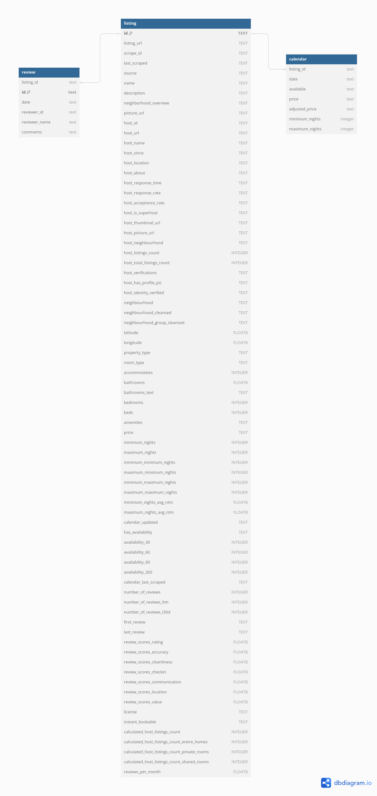

# Limpieza y transformación de datos (Caso de estudio de AirAnalytics)

<a href="https://www.flaticon.com/free-icons/airbnb" title="iconos de airbnb">Iconos de Airbnb creados por riajulislam - Flaticon

## Antecedentes y visión general

AirAnalytics (compañía ficticia) establecida en 2015, es un proveedor de datos y análisis para la industria de rentas a corto plazo. Empodera a los anfitriones, inversores y negocios con las herramientas más precisas para tener éxito
en el espacio de alquiler vacacional.

La compañía tiene cantidades masivas de información acerca de anfitriones independientes y/o alojados en sitios como Airbnb, Booking, Vrbo, TripAdvisor, etc. Esto lleva a que la recolección
de datos desde distintas fuentes sea propenso a reducir la calidad de datos. Este proyecto realiza las tareas de limpieza y transformación de datos, en una de las fuentes de datos como lo es
Airbnb (Boston, MA). Con el éxito en estas se asegura que los datos usados para la toma de decisiones es preciso, confiable y accionable. El informe detallado está localizado en [`documentacion`](https://github.com/cjmj96/limpieza-y-transformacion-de-datos/tree/main/documentacion).
Los datos utilizados vienen de InsideAirbnb [1] y se pueden descargar en la [`nube`](https://drive.google.com/drive/folders/16q4xgEGPM-RoK31yX8wkQwENX2kmSOQA?usp=sharing).
Las consultas SQL utilizadas para realizar todas las operaciones de limpieza están localizadas en [`codigo`](https://github.com/cjmj96/limpieza-y-transformacion-de-datos/tree/main/codigo). Este se divide en dos
subdirectorios, [`preparacion_de_datos`](https://github.com/cjmj96/limpieza-y-transformacion-de-datos/tree/main/codigo/preparacion_de_datos)
y [`comprension_de_datos`](https://github.com/cjmj96/limpieza-y-transformacion-de-datos/tree/main/codigo/comprension_de_datos) con archivos que contienen consultas realizadas en PostgreSQL. El archivo de volcado que permite recrear la base de datos en el mismo estado en que
estaba en el momento del volcado se puede obtener en el mismo enlace dado anteriormente.

## Estructura de datos y revisiones iniciales

La estructura de la base de datos de una de las fuentes de datos que usa AirAnalytics como se ve abajo, consistes en 3 tablas: `listing`, `calendar` y `review` con un total
combinado de 1,745,013 observaciones.

Se realizaron diferentes operaciones para la familiarización con los conjuntos datos, antes de realizar la limpieza y transformación de datos. Las consultas
SQL utilizadas para hacer estas operaciones está localizada en [`codigo/compresion_de_datos`](https://github.com/cjmj96/limpieza-y-transformacion-de-datos/tree/main/codigo/comprension_de_datos).

## Resumen ejecutivo

### Visión general de descubrimientos

Los conjuntos de datos presentan diferentes errores, que incluye: tipos de datos inapropiados, valores atípicos, valores inválidos y valores faltantes. Su presencia varía de un grado bajo a alto en
algunas columnas. Las siguientes secciones expandirán como se manejaron estos errores.

#### Idoneidad de datos

Algunas columnas en los conjuntos de datos presentaban tipos de datos erróneos para la representación correcta de los datos almacenados. Se corrigieron al realizar consultas PostgreSQL.

#### Habilidad para representar valores faltantes

La tabla `listing` representaba de manera equivocada sus valores faltantes en la columna `host_response_time`, hacía uso de cadenas de caracteres `N/A` en vez de `NULL`. Se sustituyeron
estos valores al realizar consultas PostgreSQL.

#### Consistencia de datos

Los conjuntos de datos presentaba valores inconsistentes en diferentes tablas como `listing` y `calendar`. La tabla `listing` presentaba en la columna `host_neighbourhood`,
124 vecindarios diferentes cuando en realidad, solo hay 24 [2]. El proceso de la identificación correcta de los vecindarios
se llevó a cabo usando las coordenadas espaciales aproximadas de cada listado. Como resultado de eso se redujo la cantidad de vecindarios a 24. Otras columnas de la
misma tabla y las tablas `calendar` antes listada, presentaba datos con valores anómalos. Al realizar
operaciones para filtrar estos datos las tablas `listing`, `calendar` fueron reducidas en un 56.77% y 9.51%, respectivamente. Las tablas `listing` y `calendar` quedaron
con 1,842 y 1,406,431 observaciones respectivamente.

#### Completitud de datos

El conjunto de datos presentaba datos faltantes en la tabla `listing`, específicamente en dos columnas: `host_neighbourhood` y `host_is_superhost`, con un 2% y 3% de presencia
en las observaciones, respectivamente. Al aplicar análisis de casos completos, la cantidad de observaciones con valores faltantes se redujo a cero, resultando en una
reducción en el conjunto de datos (tabla `listing`) de un 2%, ahora conteniendo 1,805 observaciones.

## Recomendaciones y pasos futuros

En función de los conocimientos adquiridos al descubrir datos con tipos inapropiados, valores atípicos, inválidos y faltantes en el conjunto de datos de Airbnb, a continuación se ofrecen algunas recomendaciones prácticas:

- Implementar un protocolo de entrada de datos estandarizado: Para evitar inconsistencias futuras, establecer pautas claras para la entrada de datos. Esto puede ayudar a mantener
la integridad de los datos y facilitar el análisis.

- Auditorías de datos periódicas: Programar auditorías periódicas del conjunto de datos para identificar y abordar los datos faltantes o inconsistentes de inmediato. Esto podría
implicar secuencias de comandos automatizadas que marquen anomalías o desviaciones de los patrones esperados, lo que permite tomar medidas correctivas más rápidas.

- Métodos mejorados de recopilación de datos: Si ciertos campos muestran constantemente datos faltantes (por ejemplo, información del anfitrión), considerar revisar el proceso
de recopilación de datos. Por ejemplo, implemente campos obligatorios durante la creación de anuncios en la plataforma para garantizar que se capture información crítica.

- Informes de calidad de datos: Crear un dashboard o informe que resuma periódicamente las métricas de calidad de los datos, como el porcentaje de valores faltantes, las
inconsistencias identificadas y las acciones tomadas para resolver estos problemas. Esta transparencia puede ayudar a las partes interesadas a comprender el estado
del conjunto de datos y priorizar las áreas que necesitan atención.

## Referencias

[1] Airbnb, “Inside Airbnb” Inside Airbnb. https://insideairbnb.com/ (Accedido: 14 de mayo de 2024).

[2] City of Boston, "Neighborhoods," boston.gov, Oct. 13, 2017. https://www.boston.gov/neighborhoods (Accedido: 18 de junio de 2024).
